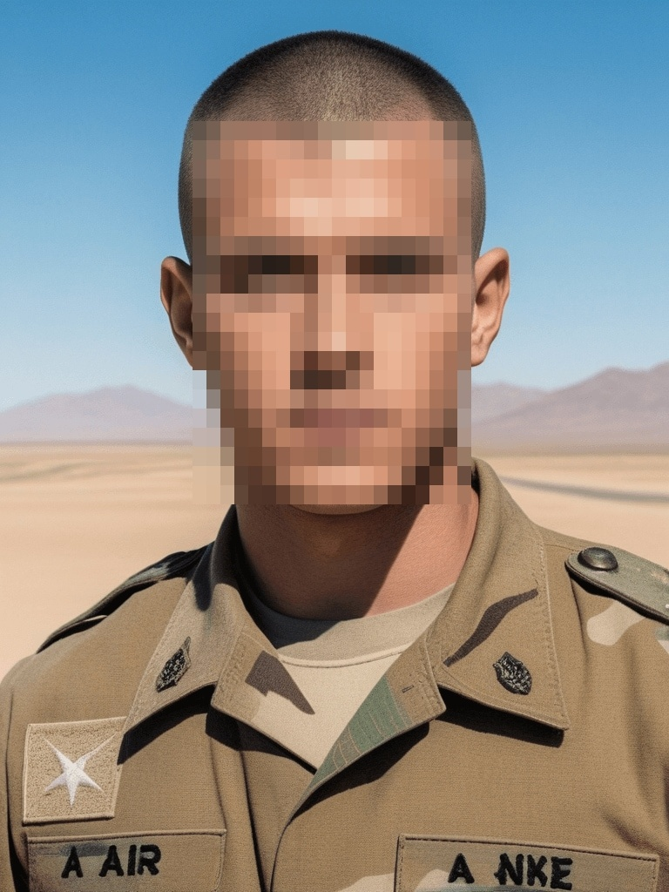

# Face Pixelizer CLI App

A command-line interface application to pixelize faces in images using the Face Pixelizer API by APILayer. This tool allows you to process images directly from a web URL or a local file on your device.

## Features
- Pixelize faces in images from a web URL.
- Pixelize faces in images from a local file.
- Download the resulting pixelized image to your local machine.
- Clear and colored command-line output.
- Detailed help messages (`-h`, `--help`).

## Prerequisites
- Python 3.6 or higher.
- An API key for the Face Pixelizer API from APILayer.
- Internet connection to access the API and download the resulting image.

## Installation
It is highly recommended to use a Python virtual environment to avoid conflicts with your system's Python installation.

1. **Clone or download the script**:
   Save the Python code provided in the immersive document as `pixelizer_app.py`.

2. **Create a virtual environment**:
   Open your terminal or command prompt and navigate to the directory where you saved `pixelizer_app.py`. Then run:
   ```bash
   python3 -m venv .venv
   ```

3. **Activate the virtual environment**:
   - On macOS and Linux:
     ```bash
     source .venv/bin/activate
     ```
   - On Windows (Command Prompt):
     ```bash
     .venv\Scripts\activate.bat
     ```
   - On Windows (PowerShell):
     ```bash
     .venv\Scripts\Activate.ps1
     ```

   Your terminal prompt should change to indicate the virtual environment is active (e.g., `(.venv) ...`).

4. **Install required packages**:
   With the virtual environment activated, install the necessary Python packages (requests and colorama):
   ```bash
   pip install requests colorama
   ```

   Alternatively, if a `requirements.txt` file is provided with the script, you can install dependencies using:
   ```bash
   pip install -r requirements.txt
   ```


## Getting an API Key

1. Go to the [APILayer website](https://apilayer.com/).

2. Find and subscribe to the Face Pixelizer API. You can directly access the Face Pixelizer API page here: <https://apilayer.com/marketplace/face_pixelizer-api>

3. Obtain your API key from your APILayer account dashboard.

## Usage
Activate your virtual environment (if not already active) before running the script:

- On macOS and Linux:
  ```bash
  source .venv/bin/activate
  ```

- On Windows (Command Prompt):
  ```bash
  .venv\Scripts\activate.bat
  ```

- On Windows (PowerShell):
  ```bash
  .venv\Scripts\Activate.ps1
  ```

Run the script using the `python` or `python3` command, providing your API key and either the `--url` or `--file` argument.

```bash
python pixelizer_app.py --api-key YOUR_API_KEY --url "https://example.com/path/to/image.jpg"
```

```bash
python pixelizer_app.py --api-key YOUR_API_KEY --file "/path/to/your/local/image.png"
```

### Optional: Specify Output File
Use the `--output` argument to specify the path and filename for the downloaded pixelized image.

```bash
python pixelizer_app.py --api-key YOUR_API_KEY --url "https://example.com/path/to/image.jpg" --output "output/pixelized_photo.jpg"
```

If `--output` is not provided, the image will be saved in the current directory with a default filename (e.g., `pixelized_image.jpg`).

## Command-Line Arguments
- `-h`, `--help`: Show the help message and exit.
- `--api-key API_KEY` (Required): Your API key for the Face Pixelizer API.
- `--url URL`: URL of the image to pixelize. (Required if `--file` is not used)
- `--file FILE`: Path to the local image file to pixelize. (Required if `--url` is not used)
- `--output OUTPUT`: Path and filename to save the pixelized image. Defaults to `pixelized_image.jpg` in the current directory.


## Examples (Before and After)

Here you can showcase the results of using the Face Pixelizer CLI App.

| Before | After |
|---|---|
| {: height="150"} | {: height="150"} |
| {: height="150"} | {: height="150"} |
| {: height="150"} | {: height="150"} |
| {: height="150"} | {: height="150"} |

## Error Handling
The script includes basic error handling for API requests, file not found errors, and download issues. Error messages will be printed to the console in red. Common errors include invalid API keys, network issues, or incorrect file paths.


## License

Creative Commons Attribution-NonCommercial 4.0 International Public License (CC BY-NC 4.0)

This is a human-readable summary of (and not a substitute for) the license.

**You are free to:**

* **Share** — copy and redistribute the material in any medium or format
* **Adapt** — remix, transform, and build upon the material

The licensor cannot revoke these freedoms as long as you follow the license terms.

**Under the following terms:**

* **Attribution** — You must give appropriate credit, provide a link to the license, and indicate if changes were made. You may do so in any reasonable manner, but not in any way that suggests the licensor endorses you or your use.
* **NonCommercial** — You may not use the material for commercial purposes.
* **No additional restrictions** — You may not apply legal terms or technological measures that legally restrict others from doing anything the license permits.

**Notices:**

* You do not have to comply with the license for elements of the material in the public domain or where your use is permitted by an applicable exception or limitation.
* No warranties are given. The license may not give you all of the permissions necessary for your intended use. For example, other rights such as publicity, privacy, or moral rights may limit how you use the material.

For the full legal text of the license, see: <https://creativecommons.org/licenses/by-nc/4.0/legalcode>
